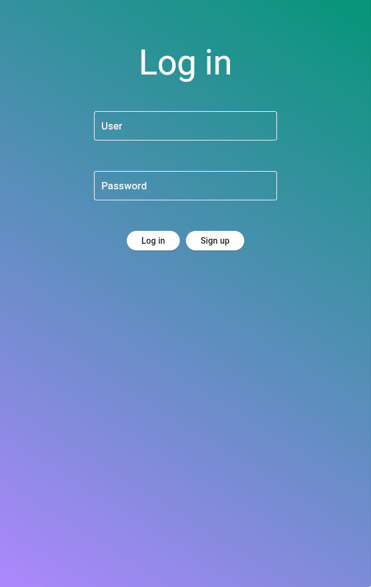
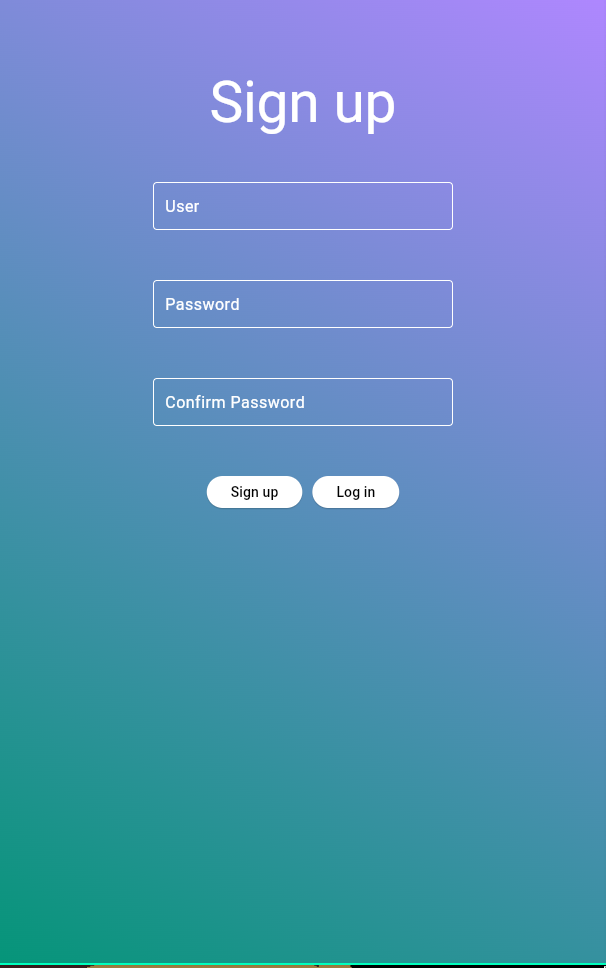

# pdm-login

## Layout

### Loading screen


### Login screen



### Sign-up screen



Setup process:

```sh
# venv setup
poetry new pdm-login
cd pdm-login
poetry add flet
source ~/.cache/pypoetry/virtualenvs/pdm-login-xYz-py3.12/bin/activate

# flet setup
flet --version
flet create pdm-login

# flet live reload
flet run -d pdm-login
```

## References
- [Getting started | Flet](https://flet.dev/docs/getting-started/)
